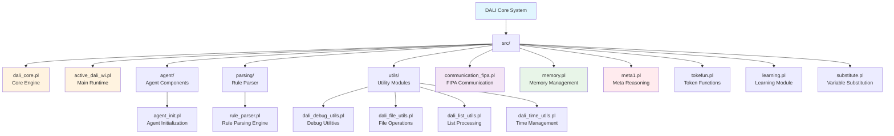
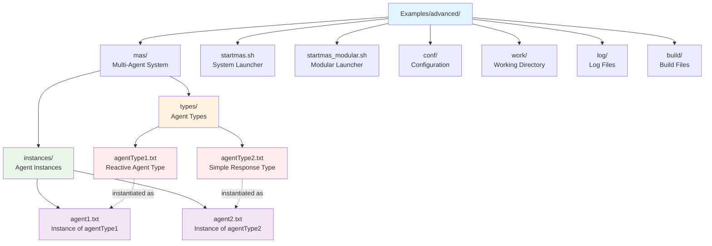
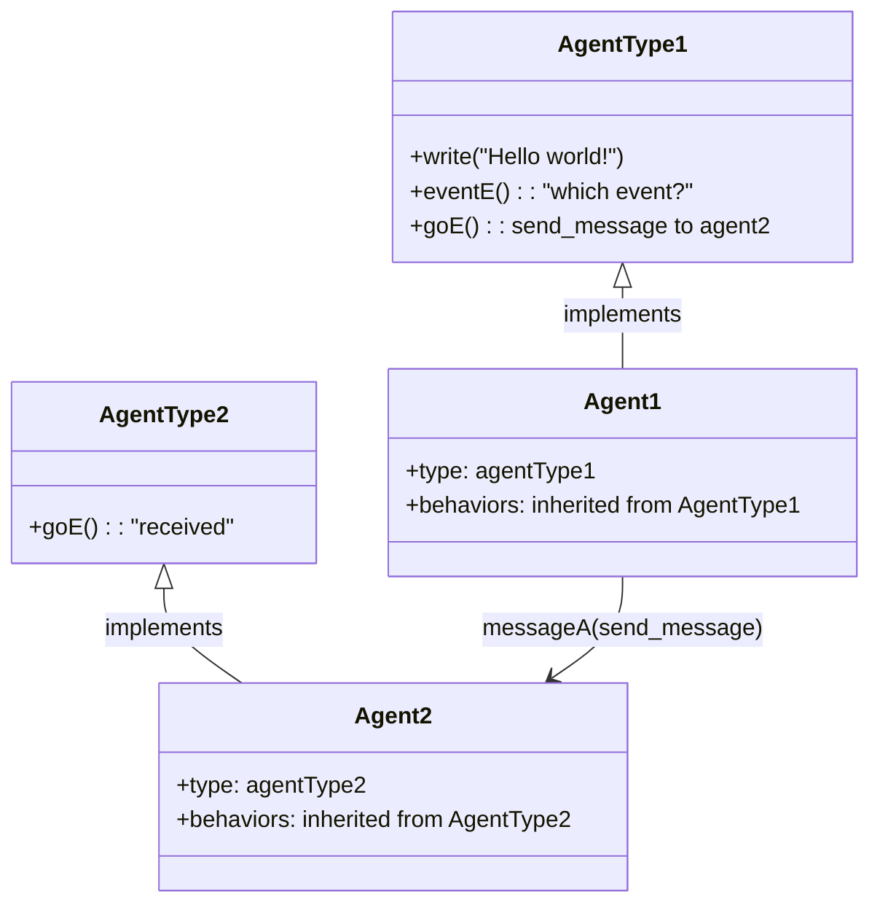
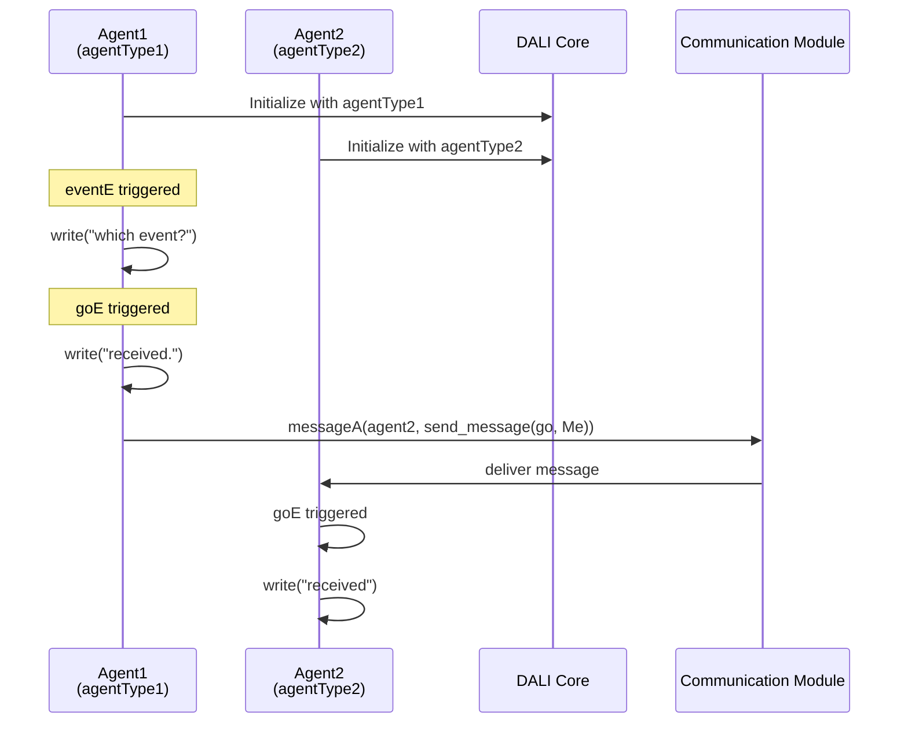
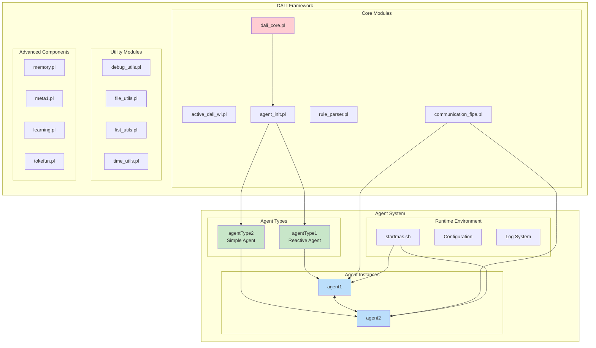

# DALI Architecture - Modules and Agents

## DALI Architecture Overview

This document visualizes the structure of DALI's main modules and the agents in the Examples/advanced folder with their types and instances.

## 1. DALI Main Modules

## 2. Advanced Agent System

## 3. Agent Type-Instance Relationships

## 4. Communication Architecture

## 5. Complete System Structure

## Component Description

### DALI Core Modules
- **dali_core.pl**: Main engine of the DALI framework
- **active_dali_wi.pl**: Runtime system for agent execution
- **agent_init.pl**: Module for agent initialization
- **rule_parser.pl**: Parser for agent rules
- **communication_fipa.pl**: Implementation of FIPA protocol for communication

### Agent Types (Examples/advanced)
- **agentType1**: Reactive agent with communication capabilities
  - Handles `eventE` and `goE` events
  - Can send messages to other agents
- **agentType2**: Simple agent with basic response
  - Handles `goE` events with minimal output

### Agent Instances
- **agent1**: Instance of agentType1
- **agent2**: Instance of agentType2
- They communicate through the DALI messaging system

### Utilities and Advanced Components
- **Utils Modules**: Debug, file, list and time management
- **Memory Management**: Memory system for agents
- **Meta Reasoning**: Meta-level reasoning capabilities
- **Learning**: Learning module for agents 