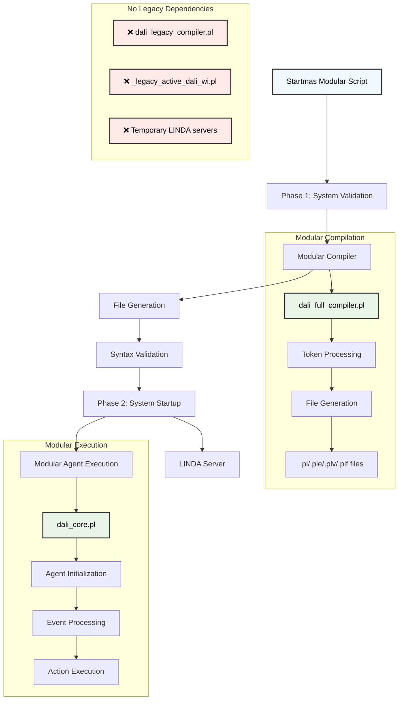

# DALI Fully Modular Architecture - No Legacy Dependencies

## Architettura Completamente Modulare

Questo diagramma mostra la nuova architettura completamente modulare di DALI, senza dipendenze dal sistema legacy.

## Flusso di Esecuzione Modulare



## Componenti Modulari Utilizzati

### Compilazione
- **dali_full_compiler.pl**: Compilatore modulare completo
- **dali_common.pl**: Componenti comuni
- **agent/agent_init.pl**: Inizializzazione agenti
- **utils/**: Utilità modulari

### Esecuzione
- **dali_core.pl**: Sistema di esecuzione modulare
- **communication_fipa.pl**: Comunicazione FIPA
- **active_server_wi.pl**: Server LINDA
- **active_user_wi.pl**: Interfaccia utente

## Vantaggi dell'Architettura Completamente Modulare

1. **Nessuna Dipendenza Legacy**: Eliminati tutti i riferimenti al sistema legacy
2. **Compilazione Modulare**: Usa `dali_full_compiler.pl` invece del compilatore legacy
3. **Esecuzione Modulare**: Usa `dali_core.pl` per l'esecuzione degli agenti
4. **Migliore Manutenibilità**: Codice più pulito e organizzato
5. **Testabilità**: Ogni modulo può essere testato indipendentemente
6. **Scalabilità**: Facile aggiungere nuove funzionalità

## Confronto: Prima vs Dopo

### Prima (Ibrido)
```
Legacy Compiler → File Generation → Modular Execution
```

### Dopo (Completamente Modulare)
```
Modular Compiler → File Generation → Modular Execution
```

## File Modificati

- **startmas_modular.sh**: Aggiornato per usare solo componenti modulari
- **Messaggi di log**: Aggiornati per riflettere l'architettura completamente modulare
- **Validazione**: Verifica presenza di tutti i componenti modulari necessari

## Risultato

Il sistema ora è **completamente modulare** senza alcuna dipendenza dal sistema legacy, mantenendo la stessa funzionalità ma con un'architettura più pulita e manutenibile.
