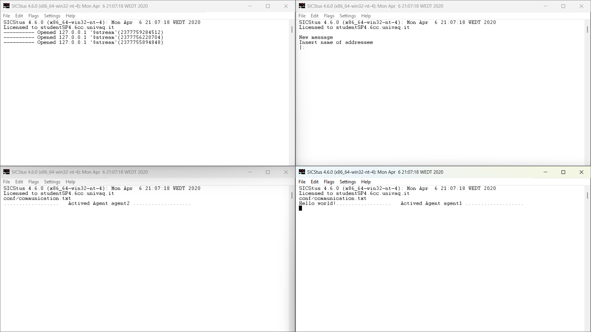
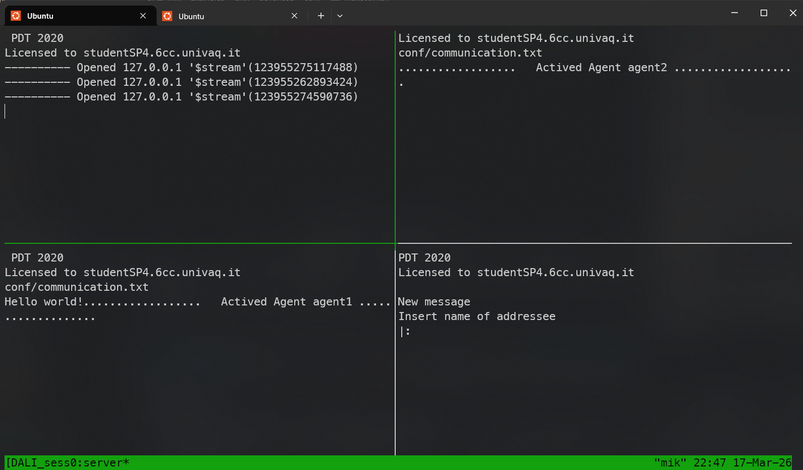
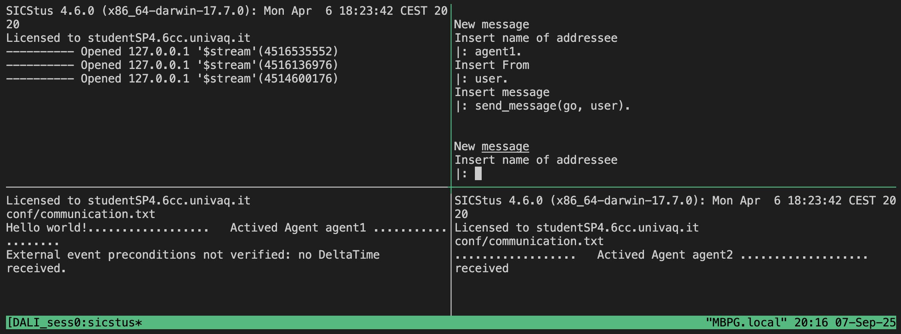
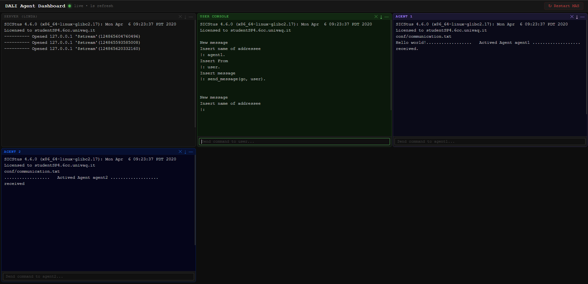
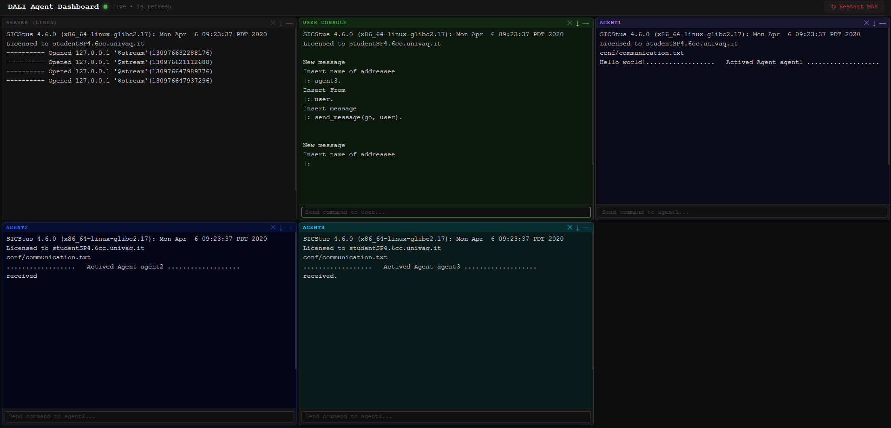
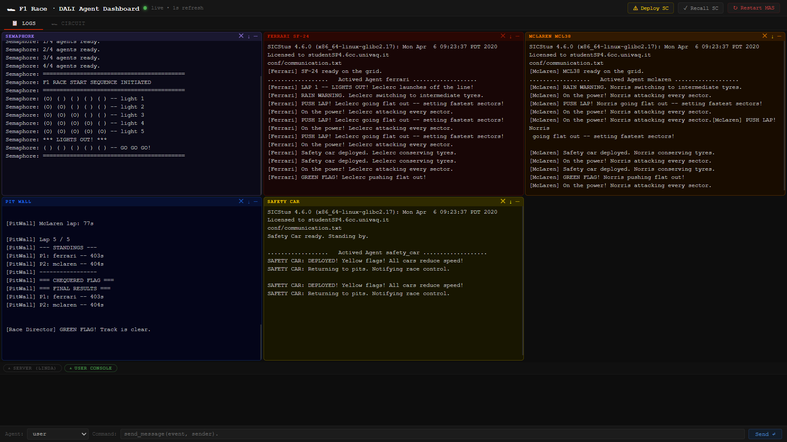
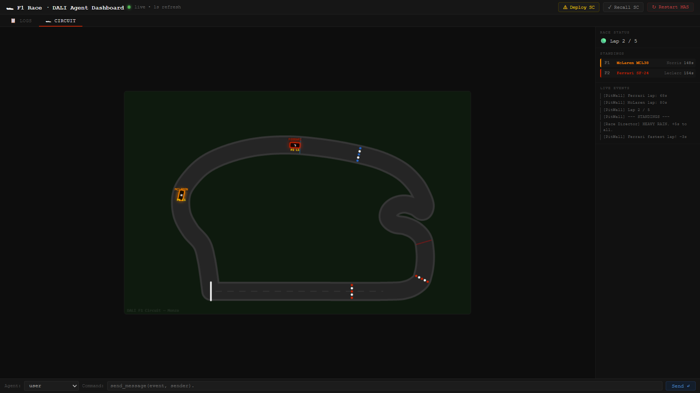

# DALI - Multi-Agent System Framework

> DALI Multi Agent Systems Framework

DALI is a meta interpreter built on top of Sicstus Prolog ® (_at the moment_).


---

## Overview

DALI is a powerful framework that extends standard logic programming with reactive and proactive capabilities. It allows for the creation of intelligent agents that can:
- **React** to external events.
- **Proactively** pursue goals.
- **Maintain** internal state and memory.
- **Communicate** using FIPA-compliant patterns.

---

## Prerequisites

DALI requires **SICStus Prolog** to be installed and activated on your system.

### 1. Download & Install
Download the SICStus Prolog interpreter from the official [website](https://sicstus.sics.se/download4.html).

### 2. License Activation
You must activate SICStus using the **site-wide license** provided by the University. Follow the installer instructions to enter the license key.

---

## Quick Start

DALI supports native execution on both Windows and Unix-like systems. For the best experience, choose the method that fits your operating system.

###  Windows (Native Batch)
No complex setup is required. The Windows scripts feature dynamic discovery of SICStus Prolog and streamlined execution.

> [!WARNING]
> **SICStus Prolog License & Version Availability**  
> The University has purchased licenses for **SICStus Prolog 4.6.0**. However, the official SICStus website currently only provides downloads for more recent versions (4.8 to 4.10).  
> To obtain the installer for the correct version (4.6.0), please contact **Prof. Giovanni De Gasperis** at [giovanni.degasperis@univaq.it](mailto:giovanni.degasperis@univaq.it).

1. Navigate to `Examples/win/basic`.
2. Double-click **`startmas.bat`**.
3. Descriptive windows for the Server, User agent, and Agents will open automatically.



### Unix (Linux / macOS / WSL2)
DALI leverages **tmux** for a powerful, tiled interface in Unix environments.

1. Navigate to `Examples/unix/advanced`.
2. Run the startup script:
   ```bash
   ./startmas.sh
   ```
3. A tmux session will launch with a tiled layout for all MAS components.



---

## Testing your MAS

Once the MAS is running, you can test the communication between agents using the **User Console** (or the Web Dashboard).

1. In the User Console window (Prolog prompt), identify the target agent:
   ```prolog
   agent1.
   ```
2. Identify yourself:
   ```prolog
   user.
   ```
3. Send a message (e.g., the `go` event):
   ```prolog
   send_message(go, user).
   ```



---

## DALI Web Dashboard

Monitor and interact with your MAS through a modern, **Zero-Config** web interface. The dashboard automatically discovers agents and provides real-time logs and command input.

### Launching the Dashboard
From a Unix-like environment (including WSL2):
```bash
cd Examples/unix
./run.sh --folder ./advanced
```
Access the UI at `http://localhost:5000`.

For more detailed information on available CLI flags and internal functionality, see [DASHBOARD.md](Examples/unix/ui/DASHBOARD.md).





---

## Repository Structure

The repository is organized to support different levels of complexity and deployment environments:

- **`src/`**: The core DALI engine and meta-interpreter.
- **`Examples/`**:
  - **`win/`**: Native Windows `.bat` architectures.
    - **`basic/`**: Simple, flat agent structures (perfect for beginners).
    - **`advanced/`**: Complex structures using agent **types** and **instances**
  - **`unix/`**: Advanced `tmux` and `bash` architectures.
    - **`basic/`**: Simple, flat agent structures (perfect for beginners).
    - **`advanced/`**: Complex structures using agent **types** and **instances**.
- **`img/`**: Screenshots and visual documentation assets.
- **`docs/`**: Technical documentation and research papers.

---

## Release History

Check the [release history](https://github.com/AAAI-DISIM-UnivAQ/DALI/releases) page for more information.

---

## Development Setup

To create your own DALI MAS from scratch, use an existing example as a boilerplate:

1. **Create a project folder** (e.g., `projectFolder`).
2. **Copy the core engine** — place the `DALI/src` folder inside your `projectFolder`.
3. **Initialize your application** — create a sub-folder for your DALI app (e.g., `DALIappFolder`).
4. **Copy a boilerplate** — use `Examples/unix/advanced` or `Examples/unix/basic` if on Unix or `Examples/win/advanced` or `Examples/win/basic` (Windows) as a starting point.
5. **Define your agents**:
   - **Advanced layout**: define agent types in `mas/types/` and instances in `mas/instances/`.
   - **Basic layout**: place all agent `.pl` files directly in `mas/`.
6. **Run the startup script** — the script will automatically discover your SICStus installation and launch the MAS.

---

## Examples of Applications

- in Robotics: coordination among store delivery robots:
  [](https://www.youtube.com/watch?v=1dfWthhUovk)
  **[Video](https://youtu.be/1dfWthhUovk)** from S. Valentini.

- F1 Race Simulator: A Formula 1 race simulator where DALI agents control racing cars in a competitive environment.
  
  
  
  
  **[Video](https://youtu.be/-SxC4x3_CWI)** from M. Piccirilli.

## References

- DALI 1.0 original URL: http://www.di.univaq.it/stefcost/Sito-Web-DALI/WEB-DALI (no more active)
- COSTANTINI, Stefania. [The DALI Agent-Oriented Logic Programming Language: Summary and References 2015.](https://people.disim.univaq.it/stefcost/pubbls/Dali_References.pdf)
- COSTANTINI S, TOCCHIO A. [A logic programming language for multi-agent systems.](docs/DALI_Language_description.pdf) Logics in Artificial Intelligence, Springer Berlin Heidelberg, 2002, pp:1-13.
- COSTANTINI S, TOCCHIO A. _The DALI logic programming agent-oriented language._ In Logics in Artificial Intelligence Springer Berlin Heidelberg, 2004, pp:685-688.
- COSTANTINI S, TOCCHIO A. _DALI: An Architecture for Intelligent Logical Agents._ In: AAAI Spring Symposium: Emotion, Personality, and Social Behavior. 2008. pp:13-18.
- BEVAR V, COSTANTINI S, TOCCHIO A, DE GASPERIS G. _A multi-agent system for industrial fault detection and repair._ In: Advances on Practical Applications of Agents and Multi-Agent Systems. Springer Berlin Heidelberg, 2012. pp:47-55.
- DE GASPERIS, G, BEVAR V, COSTANTINI S, TOCCHIO A, PAOLUCCI A. _Demonstrator of a multi-agent system for industrial fault detection and repair._ In: Advances on Practical Applications of Agents and Multi-Agent Systems. Springer Berlin Heidelberg, 2012. pp:237-240.
- DE GASPERIS Giovanni. _DETF 1st Release (Version 14.08a)._ Zenodo. [](https://doi.org/10.5281/zenodo.1044488), 2014, August 6.
- COSTANTINI, Stefania; DE GASPERIS, Giovanni; NAZZICONE, Giulio. _DALI for cognitive robotics: principles and prototype implementation._ In: International Symposium on Practical Aspects of Declarative Languages. Springer, Cham, 2017. p. 152-162.
- COSTANTINI, Stefania, DE GASPERIS, Giovanni, PITONI Valentina, SALUTARI Agnese. [DALI: A multi agent system framework for the web, cognitive robotic and complex event processing.](http://ceur-ws.org/Vol-1949/CILCpaper05.pdf), [CILC 2017](http://cilc2017.unina.it), 32nd Italian Conference on Computational Logic
  26-28 September 2017, Naples, Italy
- RAFANELLI, Andrea; COSTANTINI, Stefania; DE GASPERIS, Giovanni. [A Multi-Agent-System framework for flooding events. 2022](https://ceur-ws.org/Vol-3261/paper11.pdf). WOA 2022: 23rd Workshop From Objects to Agents, September 1–2, Genova, Italy
- COSTANTINI, Stefania. [Ensuring trustworthy and ethical behaviour in intelligent logical agents](https://academic.oup.com/logcom/article/32/2/443/6513773). Journal of Logic and Computation, 2022, 32.2: 443-478.

---

## Contacts

**Giovanni De Gasperis**  
Email: [giovanni.degasperis@univaq.it](mailto:giovanni.degasperis@univaq.it)

Distributed under the **Apache License 2.0**. See `LICENSE` for more information.

---

## Contributing

We welcome contributions!
1. **Fork** the repository.
2. Create your **feature branch** (`git checkout -b feature/fooBar`).
3. **Commit** your changes (`git commit -am 'Add some fooBar'`).
4. **Push** to the branch (`git push origin feature/fooBar`).
5. Create a new **Pull Request** to our `dev` branch.
