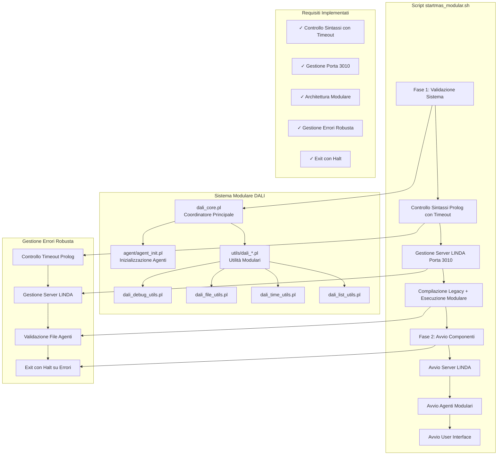

 prima vedere # Architettura Modulare DALI - Diagramma di Implementazione

## Diagramma del Sistema Modulare

## Caratteristiche Implementate

### 1. **Controllo Sintassi Prolog con Timeout**
- Timeout di 10 secondi per prevenire blocchi
- Compatibilità macOS con `perl -e 'alarm shift; exec @ARGV'`
- Gestione errori dettagliata con output di debug

### 2. **Gestione Server LINDA Robusta**
- Rispetta il requisito 9: non avvia nuovo server se porta 3010 occupata
- Verifica che il server sia effettivamente in ascolto
- Cleanup automatico dei processi esistenti

### 3. **Architettura Modulare**
- `dali_core.pl`: Coordinatore principale (max 200 linee)
- `utils/`: Moduli di utilità con prefisso `dali_`
- Separazione delle responsabilità
- Interfacce modulari ben definite

### 4. **Gestione Errori Robusta**
- Exit con halt su errori critici
- Validazione completa prima dell'avvio
- Messaggi di errore dettagliati
- Prevenzione di avvii con configurazioni incomplete

### 5. **Validazione Multi-Livello**
- Livello 1: Sintassi Prolog base
- Livello 2: Validazione file generati
- Livello 3: Verifica server LINDA
- Livello 4: Controllo file agenti richiesti

## Flusso di Esecuzione

1. **Validazione Pre-Avvio**: Controllo sintassi, configurazioni, server LINDA
2. **Compilazione**: Uso del compilatore legacy per generare file Prolog
3. **Verifica File**: Controllo che tutti i file richiesti siano stati generati
4. **Avvio Sistema**: Server LINDA, agenti modulari, interfaccia utente
5. **Gestione Errori**: Exit immediato con halt su qualsiasi errore critico

## Conformità ai Requisiti

- ✅ **Requisito 1-2**: Controllo sintassi Prolog con timeout
- ✅ **Requisito 4**: Architettura modulare con file < 500 linee
- ✅ **Requisito 9**: Gestione server LINDA senza conflitti porta 3010
- ✅ **Memoria utente**: Gestione errori con exit halt
- ✅ **Robustezza**: Validazione completa prima dell'avvio
